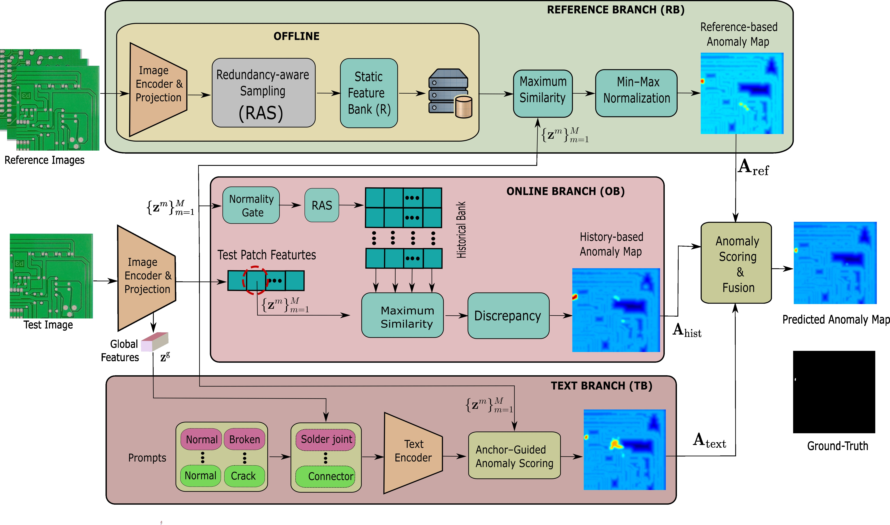

# TriAD-PCB

**Reference-Assisted Online Anomaly Detection and Segmentation for Printed Circuit Boards**.

<p align="center">
  
</p>

- **Link download masks**: https://drive.google.com/drive/folders/1yC7uz6dnDIqE7xavTo2J0UpPsgN3PRp6?usp=sharing
- **Text Branch**: semantic anchors, normal/abnormal prompts, and prompt-conditioned feature generation
- **Online Branch**: causal historical memory with redundancy-aware sampling and anomaly-aware gating
- **Reference Branch**: static few-shot support bank for prototype matching
- **Fusion**: confidence-aware weighting, residual refinement, and top-q pooling

## Implemented components

- frozen CLIP ViT-B/16 image and text encoders;
- learnable semantic anchors and anchor-conditioned normal and abnormal prompts;
- prompt-conditioned feature generator and the three Text Branch losses;
- redundancy-aware sampling;
- static few-shot Reference Branch;
- causally updated FIFO Historical Bank with anomaly-aware gating;
- confidence-aware fusion, residual refinement, and top-q pooling;
- image-level and pixel-level evaluation metrics;
- anchor ranking, random and manual anchor controls, and template-paraphrase controls;
- deterministic support-set and stream-order manifests;
- aggregation across support sets, stream orders, anchor subsets, and training seeds.

## Environment

The locked reference environment is provided in `environment.yml` and targets Python 3.11, PyTorch 2.5.1, CUDA 12.1, and Transformers 4.46.3. A CUDA-capable PyTorch installation is recommended. The deployment measurements in the manuscript use one NVIDIA A6000 GPU.

```powershell
cd code
conda env create -f environment.yml
conda activate triad-pcb
python -m pip install -e . --no-deps
```

The first execution downloads `openai/clip-vit-base-patch16` from Hugging Face. To run offline, download the checkpoint once and replace `model_name` in the configuration with its local path.

## Dataset

All datasets use one CSV schema:

```text
image_path,mask_path,label,split,category,source_id
```

`label` is 0 for normal and 1 for anomalous. `mask_path` is empty for normal images. `split` is one of `optimization`, `validation`, or `test`. Crops from the same source image or board must share the same `source_id` and must not cross splits.

Dataset images are not redistributed. Place manifests under `materials/manifests/` or pass an absolute manifest path in the configuration. `prepare_visa_manifest.py` preserves the official VisA test images and deterministically holds out 89, 89, 86, and 86 normal training images from PCB1, PCB2, PCB3, and PCB4 for validation. `prepare_tdd_crops.py` creates grouped crops from Pascal VOC annotations, `make_group_splits.py` assigns source-level partitions for datasets that do not provide fixed partitions, and `validate_manifest.py` checks paths, labels, source leakage, counts, and optional SHA-256 checksums.

For TDD-Net PCB, assign optimization, validation, and test partitions at the source-image or board level before invoking `prepare_tdd_crops.py`. The crop script requires the reviewed pixel masks, discards incomplete boundary crops, and excludes otherwise normal crops that intersect the bounding-box regions expanded by 16 pixels.

## Anchor selection

```powershell
triad-select-anchors --config configs/dspcbsd.yaml
```

The command embeds the 16 retained candidates with the four fixed seed templates, computes mean cosine relevance on normal optimization images, and writes ranked scores. Repeat for all three datasets, then use `scripts/merge_anchor_scores.py` to obtain the equal-weight ranking.

## Training

```powershell
triad-train --config configs/dspcbsd.yaml --seed 3407
triad-train --config configs/tdd.yaml --seed 3407
triad-train --config configs/visa.yaml --seed 3407
```

Checkpoints and resolved configurations are written under `outputs/<dataset>/<run_name>/`.

## Causal evaluation

```powershell
triad-evaluate --config configs/dspcbsd.yaml --checkpoint outputs/dspcbsd/default_seed3407/model.pt
```

Inference always scores the current image before evaluating the normality gate and updating the historical bank. The evaluator records every support set, stream permutation, prediction, gate decision, memory size, and branch weight.

## Controlled anchor and prompt studies

Generate the complete experiment matrix:

```powershell
triad-controlled-study plan --base-config configs/dspcbsd.yaml --output outputs/controlled_study/dspcbsd/plan.json
triad-controlled-study run --plan outputs/controlled_study/dspcbsd/plan.json
triad-controlled-study aggregate --input outputs/controlled_study/dspcbsd --output outputs/controlled_study/dspcbsd/summary.csv
```

Run the same plan for TDD-Net PCB and VisA. Configurations share the support and stream seeds in `materials/seeds.json`. The random vocabularies, manual vocabulary, default prompts, and three paraphrase sets are fixed in `materials/`.

`materials/anchor_template_reported_results.csv` and `materials/anchor_template_per_dataset_results.csv` contain the numerical values used in the manuscript tables. Fresh executions are written to `outputs/` and never overwrite these fixed tables. This separation makes it possible to compare a rerun with the manuscript values without confusing summary material with raw run logs.

## Hyperparameter sensitivity

The nested 4, 8, and 12-anchor settings, the 2, 4, and 6 abnormal-prompt settings, historical capacities of 25, 50, and 100 images, and support sizes of 1, 2, 4, and 8 images are generated from the fixed configuration and ordered semantic materials:

```powershell
triad-sensitivity plan --base-config configs/dspcbsd.yaml --output outputs/sensitivity/dspcbsd/plan.json
triad-sensitivity run --plan outputs/sensitivity/dspcbsd/plan.json
triad-sensitivity aggregate --input outputs/sensitivity/dspcbsd/evaluations --output outputs/sensitivity/dspcbsd/summary.csv
```

## Branch composition study

```powershell
triad-branch-study --config configs/dspcbsd.yaml --checkpoint outputs/dspcbsd/default_seed3407/model.pt --output outputs/branch_study/dspcbsd_seed3407
```

## Stream anomaly-ratio study

```powershell
triad-anomaly-ratio --config configs/dspcbsd.yaml --checkpoint outputs/dspcbsd/default_seed3407/model.pt --output outputs/anomaly_ratio/dspcbsd_seed3407
```

## Validation-only configuration selection

```powershell
triad-validate evaluate --config configs/dspcbsd.yaml --checkpoint outputs/dspcbsd/default_seed3407/model.pt --output outputs/validation/default.json
triad-validate select --candidates materials/configuration_candidates.example.json --output outputs/validation/selection.json
```

## Paired statistical tests

`scripts/paired_significance.py` computes paired mean differences, sample standard deviations, confidence intervals, and two-sided paired t-tests. Its input is a long CSV with the columns `dataset`, `run_id`, `method`, `metric`, and `value`. A run identifier must refer to the same training seed or evaluation repetition for both methods.

```powershell
python scripts/paired_significance.py --input outputs/statistics/paired_metrics.csv --reference TriAD-PCB --baseline FOADS --output outputs/statistics/triad_vs_foads.csv
```

